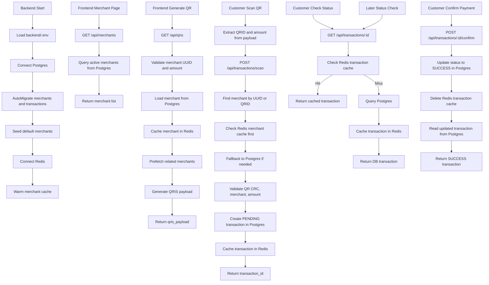

# QRIS Latency Optimizer Flow

## Notes

- Postgres is source of truth.
- Redis is cache layer for merchants and transactions.
- QRID like `TEST001` is QR payload merchant identifier.
- Merchant UUID is database primary key.
