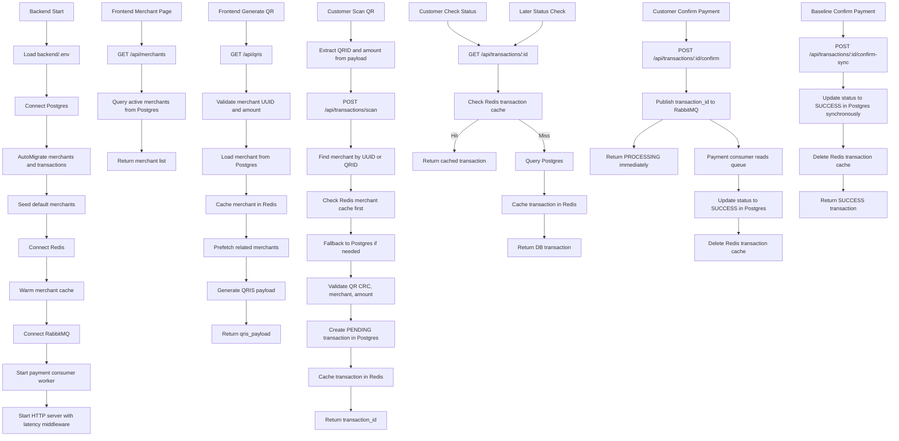
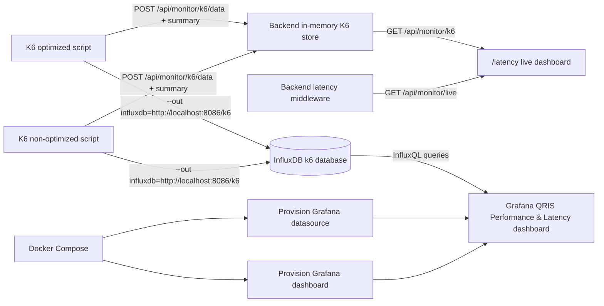

# QRIS Latency Optimizer Flow

## Notes

- Postgres is source of truth.
- Redis is cache layer for merchants and transactions.
- QRID like `TEST001` is QR payload merchant identifier.
- Merchant UUID is database primary key.
- Optimized confirm returns `PROCESSING` and finishes through RabbitMQ worker.
- Baseline confirm-sync writes to Postgres before responding.

## Monitoring Flow

## Monitoring Notes

- `/latency` is live/in-memory and resets when backend restarts.
- Grafana is persisted through InfluxDB and `grafana_data` volume.
- Grafana datasource name is `QRIS K6 InfluxDB`.
- Grafana dashboard title is `QRIS Performance & Latency`.
- K6 scenario tags are `Event_Driven_Async` and `Synchronous_DB`.
